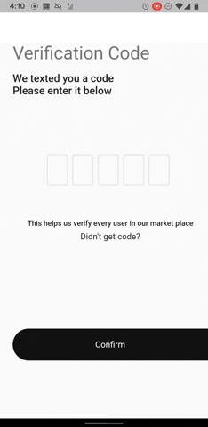
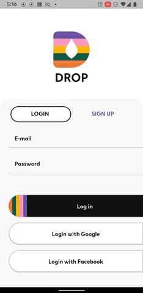

# flutter_otp_text_field

[](https://pub.dartlang.org/packages/flutter_otp_text_field)
[](https://opensource.org/licenses/MIT)


# flutter_otp_text_field

The `flutter_otp_text_field` package for flutter is a TextField widget that allows you to display different style pin. It supports all the platforms [flutter](https://github.com/flutter/flutter) supports.


## Features 👇👇
* allows you to customize the shape of textField in any way you want
* built-in 2 commonly used pin styles of shape
* obscure support
* input decoration support
* support all the textField properties support
* Flutter web support


## Installing 🔧
Install the latest version from [pub](https://pub.dartlang.org/packages/otp_textfield).

# Installing
## Use this package as a library
### 1. Depend on it
Add this to your package's pubspec.yaml file:
```
dependencies:
  flutter_otp_text_field: ^1.0.0
```
### 2. Install it
You can install packages from the command line:
with Flutter:
```
$ flutter packages get
```
Alternatively, your editor might support flutter packages get. Check the docs for your editor to learn more.

### 3. Import it
Now in your Dart code, you can use:
```
import 'package:flutter_otp_text_field/flutter_otp_text_field.dart';
```

### Example Usage 1

if you want an otp_text_field with same style or with field shaped as a box


``` 
    OtpTextField(
        numberOfFields: 5,
        borderColor: Color(0xFF512DA8),
        //set to true to show as box or false to show as dash
        showFieldAsBox: true, 
        //runs when a code is typed in
        onCodeChanged: (String code) {
            //handle validation or checks here           
        },
        //runs when every textfield is filled
        onSubmit: (String verificationCode){
            showDialog(
                context: context,
                builder: (context){
                return AlertDialog(
                    title: Text("Verification Code"),
                    content: Text('Code entered is $verificationCode'),
                );
                }
            );
        }, // end onSubmit
    ),
``` 


### Example Usage 2

if you want an otp_text_field with different styles for each field

 

``` 
    // if you want an otp_text_field with different 
    // styles for each field

    Color accentPurpleColor = Color(0xFF6A53A1);
    Color primaryColor = Color(0xFF121212);
    Color accentPinkColor = Color(0xFFF99BBD);
    Color accentDarkGreenColor = Color(0xFF115C49);
    Color accentYellowColor = Color(0xFFFFB612);
    Color accentOrangeColor = Color(0xFFEA7A3B);

    otpTextStyles = [
        createStyle(accentPurpleColor),
        createStyle(accentYellowColor),
        createStyle(accentDarkGreenColor),
        createStyle(accentOrangeColor),
        createStyle(accentPinkColor),
        createStyle(accentPurpleColor),
    ];

    TextStyle? createStyle(Color color) {
        ThemeData theme = Theme.of(context);
        return theme.textTheme.headline3?.copyWith(color: color);
    }

    OtpTextField(
            numberOfFields: 6,
            borderColor: accentPurpleColor,
            focusedBorderColor: accentPurpleColor,
            styles: otpTextStyles,
            showFieldAsBox: false,
            borderWidth: 4.0,
            //runs when a code is typed in
            onCodeChanged: (String code) {
                //handle validation or checks here if necessary         
            },
            //runs when every textfield is filled 
            onSubmit: (String verificationCode) {

            }, 
    ),
```


### Properties
Customizable Properties for OtpTextField
<table>
    <th>Attribute Name</th>
    <th>Example Value</th>
    <th>Description</th>
    <tr>
        <td>numberOfFields</td>
        <td>4</td>
        <td>The default is 4</td>
    </tr>
    <tr>
        <td>fieldWidth</td>
        <td>40</td>
        <td>allows to change the width of the textField</td>
    </tr>
    <tr>
        <td>showFieldAsBox</td>
        <td>true</td>
        <td>changes the default decoration of the textFields to a box with borderRadius of 4.0</td>
    </tr>
    <tr>
            <td>hasCustomInputDecoration</td>
            <td>true</td>
            <td>set this to true if you want to pass your own decoration</td>
    </tr>
     <tr>
            <td>decoration</td>
            <td>InputDecoration</td>
            <td>set hasCustomInputDecoration to true and pass your own input decoration the way you see fit</td>
    </tr>
    <tr>
            <td>filled</td>
            <td>false</td>
            <td>set to true if you want to pass a fillColor</td>
     </tr>
    <tr>
            <td>fillColor</td>
            <td>Color(0xFFFFFFFF)</td>
            <td>pass fillColor and set filled to true</td>
    </tr>
    <tr>
            <td>enabledBorderColor</td>
            <td>Color(0xFF4F44FF)</td>
            <td>Pass Color value to show when textfield is enabled</td>
    </tr>
    <tr>
            <td>focusedBorderColor</td>
            <td>Color(0xFF4F44FF)</td>
            <td>Pass Color value to show when textfield is in focus</td>
    </tr>
     <tr>
            <td>borderColor</td>
            <td>Color(0xFFE7E7E7)</td>
            <td>Pass Color value to set border color</td>
    </tr>
    <tr>
            <td>disabledBorderColor</td>
            <td>Color(0xFFE7E7E7)</td>
            <td>Pass Color value to show when textfield is disabled</td>
    </tr>
    <tr>
            <td>styles</td>
            <td>List<TextStyle?></td>
            <td>Pass a list of textStyles to customize the styles of each field. TextStyle in each index matches each field. Note that length of the styles array should be equal to the numberOfFields </td>
    </tr>
    <tr>
        <td>borderRadius</td>
        <td>BorderRadius.all(Radius.circular(4.0))</td>
        <td>pass BorderRadius to customise textField when showFieldAsBox is set to true</td>
    </tr>
    <tr>
        <td>margin</td>
        <td>EdgeInsets.only(right: 8.0)</td>
        <td>customize the margin between each textField</td>
    </tr>
    <tr>
        <td>textStyle</td>
        <td>TextStyle(fontSize: 20, color: Colors.green);</td>
        <td>Add custom textStyle</td>
    </tr>
    <tr>
            <td>borderWidth</td>
            <td>2.0</td>
            <td>Default value is 2.0, allows you to customize the width of the border</td>
    </tr>
    <tr>
        <td>cursorColor</td>
        <td>Colors.blue</td>
        <td>Change color of textFields cursor. Defaults to [ThemeData.cursorColor] 
        or [CupertinoTheme.primaryColor] depending on [ThemeData.platform]. 
        </td>
    </tr>
    <tr>
        <td>mainAxisAlignment</td>
        <td>MainAxisAlignment.center</td>
        <td>Defaults to MainAxisAlignment.center</td>
    </tr>
     <tr>
        <td>crossAxisAlignment</td>
        <td>CrossAxisAlignment.center</td>
        <td>Defaults to CrossAxisAlignment.center</td>
    </tr>
    <tr>
        <td>onSubmit</td>
        <td>(String pin){}</td>
        <td>The callback will execute when user is done inputting the verification code.</td>
    </tr>
    <tr>
        <td>keyboardType</td>
        <td>TextInputType.number</td>
        <td>Just like TextField's keyboardType, the default is TextInputType.number</td>
    </tr>
    <tr>
        <td>clearText</td>
        <td>Bool</td>
        <td>When set to true, it clears all the text in the fields</td>
    </tr>
    <tr>
        <td>autoFocus</td>
        <td>false</td>
        <td>Same as TextField's autoFocus, the default is false</td>
    </tr>
    <tr>
        <td>enabled</td>
        <td>true</td>
        <td>Same as TextField's enabled, the default is true</td>
    </tr>
    <tr>
        <td>obscureText</td>
        <td>false</td>
        <td>Defaults to false</td>
    </tr>
    <tr>
        <td>onCodeChanged</td>
        <td>(String code){}</td>
        <td>Executes every time a value is entered into the textField. Same as TextField's onChanged</td>
    </tr>
    <tr>
        <td>handleControllers</td>
        <td>(List<TextEditingController?> controllers){}</td>
        <td>exposes the list of textEditingControllers to control the textFields. This can be set to a local variable for manipulation</td>
    </tr>
</table>